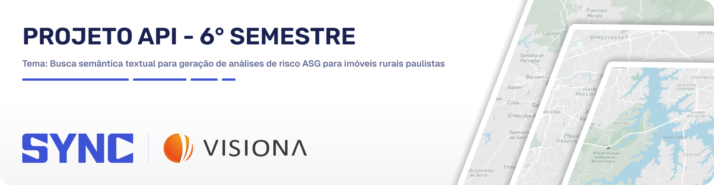
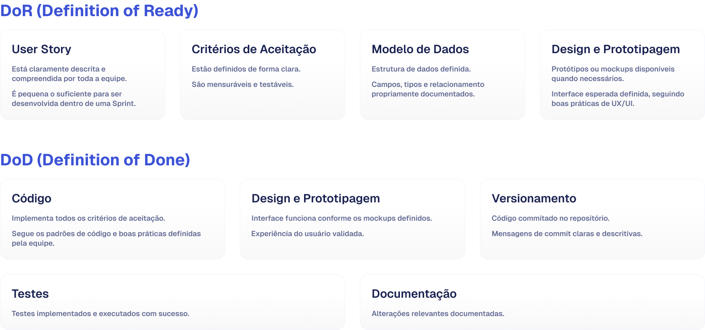
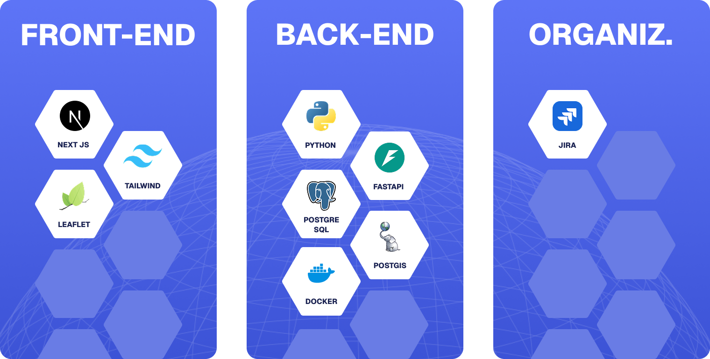
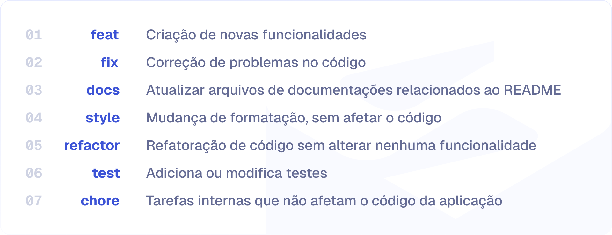

  <a href="#descricao"> Descrição </a> |
  <a href="#objetivo"> Objetivo </a> |
  <a href="#requisitos-funcionais"> Req. Funcionais </a> |
  <a href="#requisitos-nao-funcionais"> Req. Não Funcionais </a> |
  <a href="#product-backlog"> Product Backlog </a> |
  <a href="#dor-dod"> DoR e DoD</a> |
  <a href="#sprints"> Sprints </a> |
  <a href="#mvp"> MVP </a> |
  <a href="#tecnologias"> Tecnologias </a> |
  <a href="#padroes-de-commit"> Padrões de Commit </a> |
  <a href="#membros"> Membros </a> 

 
 

<h2 id='descricao'> 📄 Descrição do projeto </h2>

Este projeto consiste no desenvolvimento de uma plataforma web para análise de aspectos Ambientais, Sociais e de Governança (ASG) de propriedades rurais do Estado de São Paulo. A solução utiliza dados públicos de diferentes fontes oficiais, permitindo o cruzamento de informações geoespaciais para identificar passivos ambientais, como desmatamento, queimadas e interseções com áreas protegidas. Além disso, o sistema possibilita consultas por meio de linguagem natural, retornando respostas claras, visuais e rastreáveis.

 

<h2 id='objetivo'> 🎯 Objetivo do projeto </h2>

O objetivo do sistema é apoiar a análise de risco socioambiental de propriedades rurais, fornecendo informações integradas e acessíveis para auxiliar na tomada de decisão por órgãos públicos, instituições e demais usuários interessados em práticas sustentáveis.

 
<h2 id='requisitos-funcionais'> 📚 Requisitos Funcionais </h2>

| Número | Descrição |
|--------|-----------|
| RF1 | O sistema deve permitir consultar propriedades rurais por identificador (ex: código CAR). |
| RF2 | O sistema deve exibir a propriedade consultada em um mapa interativo. |
| RF3 | O sistema deve apresentar informações básicas da propriedade (localização e área). |
| RF4 | O sistema deve permitir consultas por meio de linguagem natural (chat). |
| RF5 | O sistema deve interpretar as consultas do usuário e retornar respostas relevantes. |
| RF6 | O sistema deve integrar dados públicos de diferentes fontes oficiais. |
| RF7 | O sistema deve realizar análises geoespaciais para identificar passivos ambientais. |
| RF8 | O sistema deve identificar desmatamento e queimadas na área da propriedade. |
| RF9 | O sistema deve identificar interseções com áreas protegidas (ex: unidades de conservação e terras indígenas, territórios quilombolas). |
| RF10 | O sistema deve apresentar uma análise consolidada dos aspectos ASG da propriedade. |
| RF11 | O sistema deve exibir as fontes dos dados utilizados nas análises. |
| RF12 | O sistema deve permitir a visualização de camadas geográficas no mapa. |
| RF13 | O sistema deve disponibilizar os dados e análises para integração com outros sistemas. |

 

<h2 id='requisitos-nao-funcionais'> 📚 Requisitos Não Funcionais </h2>

| Número | Descrição |
|--------|-----------|
| RNF1 | O Sistema deve ser organizado utilizando orientação a serviços, fazendo uso de padrões de dados abertos e que possam ser integrados/consumidos por outros sistemas (e.g., Sistemas de Informações Geográficas tais como o QGIS). |
| RNF2 | A linguagem de programação utilizada deve ser Python 3.x |
| RNF3 | As respostas às análises solicitadas ou descrições apresentadas nos relatórios devem ser rastreáveis (e.g., informar quais as fontes de dados foram utilizadas). |
| RNF4 | O Desempenho deve ser compatível com uma boa experiência de usuário (e.g., respostas geradas em poucos segundos: 1 a 10 segundos, por exemplo). |
| RNF5 | No caso de utilização de dados sujeitos às políticas da LGPD, deve-se utilizar fatores de segurança que permitam sua adequação. |
| RNF6 | Todo o sistema deve ser configurável sem a necessidade de alteração de código-fonte. |

 

<h2 id='product-backlog'> 📖 Product Backlog </h2>

| Rank | Prioridade | User Story | Estimativa | Sprint |
|------|-----------|------------|------------|--------|
| 1 | Alta | Como usuário, quero informar o código de uma propriedade rural para que eu possa consultar suas informações geográficas. | 3 | 1 |
| 2 | Alta | Como usuário, quero visualizar a propriedade rural no mapa para entender sua localização e dimensão. | 5 | 1 |
| 3 | Alta | Como usuário, quero visualizar informações básicas da propriedade para compreender seu contexto inicial. | 3 | 1 |
| 4 | Alta | Como usuário, quero interagir com o mapa (zoom, navegação e clique) para explorar a propriedade. | 5 | 1 |
| 5 | Alta | Como usuário, quero visualizar diferentes camadas ambientais no mapa para entender o contexto geográfico da propriedade. | 5 | 1 |
| 6 | Alta | Como usuário, quero que o sistema utilize dados públicos integrados de diferentes fontes para garantir análises completas. | 8 | 1 |
| 7 | Alta | Como administrador, quero atualizar a base de dados manualmente para garantir que o sistema utilize informações recentes. | 5 | 1 |
| 8 | Alta | Como sistema, quero atualizar automaticamente os dados em intervalos definidos para manter a base sempre atualizada. | 8 | 1 |
| 9 | Média | Como usuário, quero fazer perguntas em linguagem natural para obter informações sobre queimadas, desmatamento, terras indígenas, unidades de conservação, comunidades quilombolas e imóveis rurais no Estado de São Paulo. | 5 | 1 |
| 10 | Média | Como usuário, quero que o sistema identifique automaticamente a intenção da minha pergunta para que eu receba a resposta correta sem precisar seguir um formato rígido. | 8 | 1 |
| 11 | Média | Como usuário, quero receber um resumo textual junto com os pontos no mapa para entender de onde vieram os dados retornados. | 5 | 1 |
| 12 | Média | Como usuário, quero visualizar a fonte de cada dado retornado (INPE, FUNAI, ICMBio, Palmares, SICAR) para garantir rastreabilidade das análises. | 3 | 1 |
| 13 | Alta | Como usuário, quero combinar dois temas em uma única pergunta (ex: "queimadas e unidades de conservação em Ubatuba") para obter respostas integradas sem precisar fazer consultas separadas. | 8 | 2 |
| 14 | Alta | Como analista, quero que o sistema cruze os dados de um imóvel rural (CAR) com alertas de queimadas e desmatamento na mesma região para identificar automaticamente se a propriedade está associada a passivos ambientais. | 8 | 2 |
| 15 | Alta | Como usuário, quero visualizar uma nota de risco socioambiental de 0 a 100 da propriedade consultada, calculada com base nos dados de desmatamento, queimadas e interseções com áreas protegidas, para apoiar a tomada de decisão. | 8 | 2 |
| 16 | Média | Como usuário, quero exportar o resultado da análise em PDF contendo o resumo, os dados e o mapa para compartilhar ou arquivar o relatório. | 5 | 2 |
| 17 | Média | Como usuário, quero visualizar o contorno correto do Estado de São Paulo no mapa para compreender os limites geográficos das análises realizadas. | 3 | 2 |
| 18 | Alta | Como administrador, quero que o acesso à plataforma exija autenticação para garantir que apenas usuários autorizados utilizem o sistema. | 5 | 3 |
| 19 | Alta | Como usuário, quero acessar o histórico das minhas consultas anteriores para retomar análises sem precisar repetir as perguntas. | 5 | 3 |
| 20 | Alta | Como equipe, queremos que o sistema esteja implantado em ambiente de produção em nuvem para que esteja disponível de forma estável e escalável. | 8 | 3 |
| 21 | Média | Como analista GIS, quero consumir as camadas geoespaciais geradas pelo sistema diretamente no QGIS para integrar os dados às minhas análises. | 8 | 3 |

 

<h2 id='dor-dod'> DoR e DoD </h2>

 

 

<h2 id='sprints'> 📌 Sprints </h2>

<table>
  <thead>
    <tr align="center">
      <th>Sprints</th>
      <th>Data de Início</th>
      <th>Data de Término</th>
      <th>Documentos</th>
      <th>Status</th>
    </tr>
  </thead>
  <tbody>
    <tr align="center">
      <td>01</td>
      <td>16/03/2026</td>
      <td>05/04/2026</td>
      <td><a href="https://github.com/Sync-FATEC/API-2026-6SEM/blob/main/sprints/sprint01/sprint01.md">Relatório</a></td>
      <td>✅</td>
    </tr>
    <tr align="center">
      <td>02</td>
      <td>13/04/2026</td>
      <td>03/05/2026</td>
      <td><a href="https://github.com/Sync-FATEC/API-2026-6SEM/blob/main/sprints/sprint02/sprint02.md">Relatório</a></td>
      <td>⏳</td>
    </tr>
    <tr align="center">
      <td>03</td>
      <td>11/05/2026</td>
      <td>31/05/2026</td>
      <td></td>
      <td>⏳</td>
    </tr>
  </tbody>
</table>

 

<h2 id='mvp'> 🎥 MVP </h2>

 

<h2 id='tecnologias'> 💻 Tecnologias </h2>
 

 

<h2 id='padroes-de-commit'> 📨 Padrões de Commit </h2>
 

 

<h2 id='membros'> 👷 Membros </h2>

| Foto | Nome | Função | Github | Linkedin |
| :---------: | :---------: | :---------------------: | :-----------------: | :-------: |
|  | Marco Antonio Arantes | Scrum Master |  |  |
|  | Ana Laura Moratelli | Product Owner |  |  |
|  | Arthur Karnas | Desenvolvedor |  |  |
|  | Erik Yokota | Desenvolvedor |  |  |
|  | Filipe Colla | Desenvolvedor |  |  |
|  | João Gabriel Solis | Desenvolvedor |  |  |
|  | José Eduardo Fernandes | Desenvolvedor |  |  |
|  | Juan Soares | Desenvolvedor |  |  |
|  | Kauê Francisco | Desenvolvedor |  |  |

<a href='#topo'> Voltar ao topo </a>

