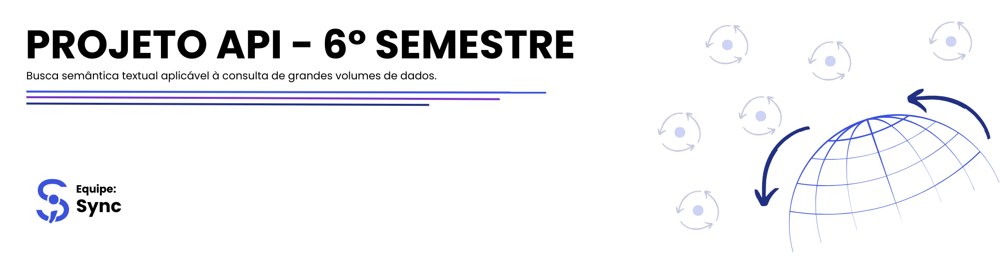
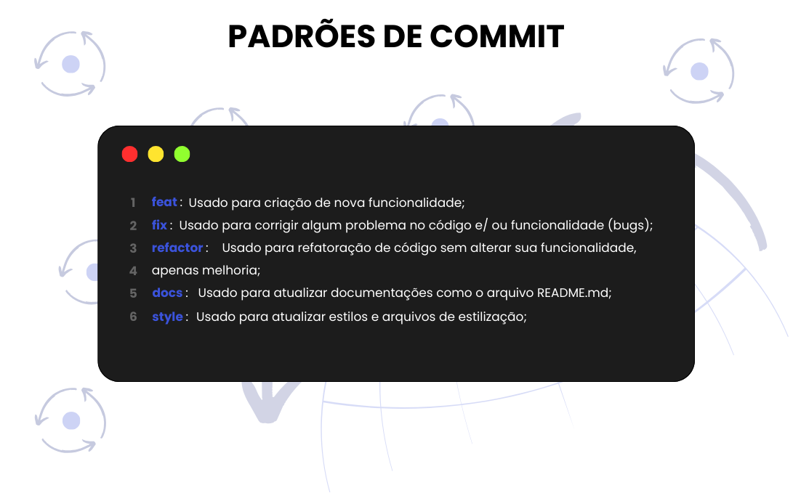

<h2 id='topo'></h2>

<a href="#descricao"> 📄 Descrição do projeto </a> |
<a href="#objetivo"> 🎯 Objetivo do projeto </a> |
<a href="#requisitos-funcionais"> 📚 Requisitos Funcionais </a> |
<a href="#requisitos-nao-funcionais"> 📚 Requisitos Não Funcionais </a> |
<a href="#product-backlog"> 📖 Product Backlog </a> |
<a href="#dor"> DoR </a> |
<a href="#dod"> DoD </a> |
<a href="#sprints"> 📌 Sprints </a> |
<a href="#mvp"> 🎥 MVP </a> |
<a href="#tecnologias"> 💻 Tecnologias </a> |
<a href="#padroes-de-commit"> 📨 Padrões de Commit </a> |
<a href="#membros"> 👥 Membros </a> 

<h2 id='descricao'> 📄 Descrição do projeto </h2>

Este projeto consiste no desenvolvimento de uma plataforma web para análise de aspectos Ambientais, Sociais e de Governança (ASG) de propriedades rurais do Estado de São Paulo. A solução utiliza dados públicos de diferentes fontes oficiais, permitindo o cruzamento de informações geoespaciais para identificar passivos ambientais, como desmatamento, queimadas e interseções com áreas protegidas. Além disso, o sistema possibilita consultas por meio de linguagem natural, retornando respostas claras, visuais e rastreáveis.

<h2 id='objetivo'> 🎯 Objetivo do projeto </h2>

O objetivo do sistema é apoiar a análise de risco socioambiental de propriedades rurais, fornecendo informações integradas e acessíveis para auxiliar na tomada de decisão por órgãos públicos, instituições e demais usuários interessados em práticas sustentáveis.

<h2 id='requisitos-funcionais'> 📚 Requisitos Funcionais </h2>

| Número | Descrição |
|--------|-----------|
| RF1 | O sistema deve permitir consultar propriedades rurais por identificador (ex: código CAR). |
| RF2 | O sistema deve exibir a propriedade consultada em um mapa interativo. |
| RF3 | O sistema deve apresentar informações básicas da propriedade (localização e área). |
| RF4 | O sistema deve permitir consultas por meio de linguagem natural (chat). |
| RF5 | O sistema deve interpretar as consultas do usuário e retornar respostas relevantes. |
| RF6 | O sistema deve integrar dados públicos de diferentes fontes oficiais. |
| RF7 | O sistema deve realizar análises geoespaciais para identificar passivos ambientais. |
| RF8 | O sistema deve identificar desmatamento e queimadas na área da propriedade. |
| RF9 | O sistema deve identificar interseções com áreas protegidas (ex: unidades de conservação e terras indígenas). |
| RF10 | O sistema deve apresentar uma análise consolidada dos aspectos ASG da propriedade. |
| RF11 | O sistema deve exibir as fontes dos dados utilizados nas análises. |
| RF12 | O sistema deve permitir a visualização de camadas geográficas no mapa. |
| RF13 | O sistema deve disponibilizar os dados e análises para integração com outros sistemas. |

<h2 id='requisitos-nao-funcionais'> 📚 Requisitos Não Funcionais </h2>

| Número | Descrição |
|--------|-----------|
| RNF1 | O Sistema deve ser organizado utilizando orientação a serviços, fazendo uso de padrões de dados abertos e que possam ser integrados/consumidos por outros sistemas (e.g., Sistemas de Informações Geográficas tais como o QGIS). |
| RNF2 | A linguagem de programação utilizada deve ser Python 3.x |
| RNF3 | As respostas às análises solicitadas ou descrições apresentadas nos relatórios devem ser rastreáveis (e.g., informar quais as fontes de dados foram utilizadas). |
| RNF4 | O Desempenho deve ser compatível com uma boa experiência de usuário (e.g., respostas geradas em poucos segundos: 1 a 10 segundos, por exemplo). |
| RNF5 | No caso de utilização de dados sujeitos às políticas da LGPD, deve-se utilizar fatores de segurança que permitam sua adequação. |
| RNF6 | Todo o sistema deve ser configurável sem a necessidade de alteração de código-fonte. |

<h2 id='product-backlog'> 📖 Product Backlog </h2>

<table>
  <thead>
    <tr align="center">
      <th>Rank</th>
      <th>Prioridade</th>
      <th>User Story</th>
      <th>Estimativa</th>
      <th>Sprint</th>
    </tr>
  </thead>
  <tbody>
    <tr align="center">
      <td>1</td>
      <td>Alta</td>
      <td>Como usuário, quero informar o código de uma propriedade rural para que eu possa consultar suas informações geográficas.</td>
      <td>3</td>
      <td>1</td>
    </tr>
    <tr align="center">
      <td>2</td>
      <td>Alta</td>
      <td>Como usuário, quero visualizar a propriedade rural no mapa para entender sua localização e dimensão.</td>
      <td>5</td>
      <td>1</td>
    </tr>
    <tr align="center">
      <td>3</td>
      <td>Alta</td>
      <td>Como usuário, quero visualizar informações básicas da propriedade para compreender seu contexto inicial.</td>
      <td>3</td>
      <td>1</td>
    </tr>
    <tr align="center">
      <td>4</td>
      <td>Alta</td>
      <td>Como usuário, quero interagir com o mapa (zoom, navegação e clique) para explorar a propriedade.</td>
      <td>5</td>
      <td>1</td>
    </tr>
    <tr align="center">
      <td>5</td>
      <td>Alta</td>
      <td>Como usuário, quero visualizar diferentes camadas ambientais no mapa para entender o contexto geográfico da propriedade.</td>
      <td>5</td>
      <td>1</td>
    </tr>
    <tr align="center">
      <td>6</td>
      <td>Alta</td>
      <td>Como usuário, quero visualizar um indicador de carregamento para entender quando o sistema está processando informações.</td>
      <td>3</td>
      <td>1</td>
    </tr>
    <tr align="center">
      <td>7</td>
      <td>Alta</td>
      <td>Como usuário, quero que o sistema utilize dados públicos integrados de diferentes fontes para garantir análises completas.</td>
      <td>8</td>
      <td>1</td>
    </tr>
    <tr align="center">
      <td>8</td>
      <td>Alta</td>
      <td>Como usuário, quero que o sistema realize cruzamentos geoespaciais para identificar relações entre a propriedade e dados ambientais.</td>
      <td>8</td>
      <td>1</td>
    </tr>
    <tr align="center">
      <td>9</td>
      <td>Média</td>
      <td>Como usuário, quero fazer perguntas em linguagem natural para obter informações sobre uma propriedade.</td>
      <td>5</td>
      <td>2</td>
    </tr>
    <tr align="center">
      <td>10</td>
      <td>Média</td>
      <td>Como usuário, quero que o sistema compreenda diferentes formas de perguntas para obter respostas corretas independentemente da forma como escrevo.</td>
      <td>8</td>
      <td>2</td>
    </tr>
    <tr align="center">
      <td>11</td>
      <td>Média</td>
      <td>Como usuário, quero saber se a propriedade possui passivos ambientais para avaliar riscos.</td>
      <td>5</td>
      <td>2</td>
    </tr>
    <tr align="center">
      <td>12</td>
      <td>Média</td>
      <td>Como usuário, quero saber se a propriedade intersecta áreas protegidas para avaliar conformidade ambiental.</td>
      <td>5</td>
      <td>2</td>
    </tr>
    <tr align="center">
      <td>13</td>
      <td>Média</td>
      <td>Como usuário, quero entender se a propriedade está em conformidade ambiental para tomada de decisão.</td>
      <td>8</td>
      <td>2</td>
    </tr>
    <tr align="center">
      <td>14</td>
      <td>Média</td>
      <td>Como usuário, quero visualizar uma análise consolidada ASG para compreender o status geral da propriedade.</td>
      <td>8</td>
      <td>2</td>
    </tr>
    <tr align="center">
      <td>15</td>
      <td>Média</td>
      <td>Como usuário, quero visualizar um score ASG para comparar propriedades.</td>
      <td>5</td>
      <td>2</td>
    </tr>
    <tr align="center">
      <td>16</td>
      <td>Média</td>
      <td>Como usuário, quero receber explicações claras sobre os resultados para entender o motivo das análises.</td>
      <td>5</td>
      <td>2</td>
    </tr>
    <tr align="center">
      <td>17</td>
      <td>Média</td>
      <td>Como usuário, quero visualizar a origem dos dados utilizados para garantir confiabilidade das análises.</td>
      <td>3</td>
      <td>2</td>
    </tr>
    <tr align="center">
      <td>18</td>
      <td>Baixa</td>
      <td>Como usuário, quero visualizar áreas de risco destacadas no mapa para identificar problemas rapidamente.</td>
      <td>5</td>
      <td>3</td>
    </tr>
    <tr align="center">
      <td>19</td>
      <td>Baixa</td>
      <td>Como usuário, quero acessar consultas anteriores para acompanhar análises realizadas.</td>
      <td>3</td>
      <td>3</td>
    </tr>
    <tr align="center">
      <td>20</td>
      <td>Baixa</td>
      <td>Como usuário, quero que o sistema responda rapidamente para garantir uma boa experiência de uso.</td>
      <td>5</td>
      <td>3</td>
    </tr>
    <tr align="center">
      <td>21</td>
      <td>Baixa</td>
      <td>Como usuário, quero uma interface simples e intuitiva para facilitar a utilização do sistema.</td>
      <td>3</td>
      <td>3</td>
    </tr>
    <tr align="center">
      <td>22</td>
      <td>Baixa</td>
      <td>Como usuário, quero que o sistema possa ser integrado a ferramentas SIG, como o QGIS, para ampliar as possibilidades de análise.</td>
      <td>8</td>
      <td>3</td>
    </tr>
    <tr align="center">
      <td>23</td>
      <td>Baixa</td>
      <td>Como usuário, quero acessar os dados e análises por meio de serviços para permitir integração com outras aplicações.</td>
      <td>8</td>
      <td>3</td>
    </tr>
    <tr align="center">
      <td>24</td>
      <td>Baixa</td>
      <td>Como usuário, quero que meus dados estejam protegidos para garantir segurança e conformidade com a LGPD.</td>
      <td>5</td>
      <td>3</td>
    </tr>
  </tbody>
</table>

<h2 id='dor'> DoR (Definitions of Ready) </h2>

### User Story
- Está claramente descrita e compreendida por toda a equipe.
- É pequena o suficiente para ser desenvolvida dentro de uma Sprint.

### Critérios de Aceitação
- Estão definidos de forma clara.
- São mensuráveis e testáveis.

### Modelo de Dados
- Estrutura de dados definida.
- Campos, tipos e relacionamentos documentados.

### Design / Mockups
- Protótipos ou mockups disponíveis quando necessários.
- Interface esperada definida.

<h2 id='dod'> DoD (Definition of Done) </h2>

### Código
- Implementa todos os critérios de aceitação.
- Segue os padrões de código definidos pela equipe.

### Testes
- Testes implementados e executados com sucesso.

### Versionamento
- Código commitado no repositório.
- Mensagens de commit claras e descritivas.

### Interface
- Interface funciona conforme os mockups definidos.
- Experiência do usuário validada.

### Documentação
- Alterações relevantes documentadas.

<h2 id='sprints'> 📌 Sprints </h2>

<table>
  <thead>
    <tr align="center">
      <th>Sprints</th>
      <th>Data de Início</th>
      <th>Data de Término</th>
      <th>Documentos</th>
      <th>Status</th>
    </tr>
  </thead>
 <tbody>
  <tr align="center">
    <td>01</td>
    <td>16/03/2026</td>
    <td>05/04/2026</td>
    <td>Em breve</td> 
    <td>🔄</td>
  </tr>
  <tr align="center">
    <td>02</td>
    <td>13/04/2026</td>
    <td>03/05/2026</td>
    <td></td> 
    <td>✖️</td>
  </tr>
  <tr align="center">
    <td>03</td>
    <td>11/05/2026</td>
    <td>31/05/2026</td>
    <td></td> 
    <td>✖️</td>
  </tr>
</tbody>
</table>

<h2 id='mvp'> 🎥 MVP </h2>
Em breve

<h2 id='tecnologias'> 💻 Tecnologias </h2>
Em breve

<h2 id='padroes-de-commit'> 📨 Padrões de Commit </h2>
Atualizando ainda

<h2 id='membros'> 👥 Membros </h2>

| Foto | Nome | Função | Github | Linkedin |
| :---------: | :---------: | :---------------------: | :-----------------: | :-------: |
|  | Marco Antonio Arantes | Scrum Master |  |  |
|  | Ana Laura Moratelli | Product Owner |  |  |
|  | Arthur Karnas | Desenvolvedor |  |  |
|  | Erik Yokota | Desenvolvedor |  |  |
|  | Filipe Colla | Desenvolvedor |  |  |
|  | João Gabriel Solis | Desenvolvedor |  |  |
|  | José Eduardo Fernandes | Desenvolvedor |  |  |
|  | Juan Soares | Desenvolvedor |  |  |
|  | Kauê Francisco | Desenvolvedor |  |  |

<a href='#topo'> Voltar ao topo </a>

